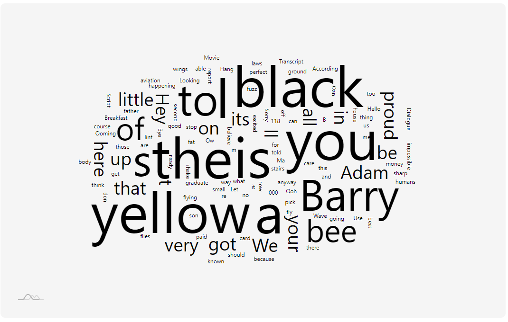
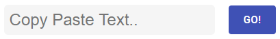

# [Cloudy](https://cloudy-word-cloud.herokuapp.com/)


Table of Contents
=================

   * [Description](#description)
   * [Installation & Usage](#installation-and-usage)
   * [Components](#components)
      * [Header](#header)
      * [Word Cloud](#about-me)
      * [Input Box](#input-box)
   * [Dependencies](#dependencies)


# Description

This web app is built using ReactJS, amCharts 4 Library, and material UI. The purpose of this web app is to create a word cloud from the text inputted from the user.

# Installation and Usage

The portfolio application requires [Node.js](https://nodejs.org/) to run locally.

First, clone the repository. Then cd into the app, install the dependencies, and start the server.

```
$ cd word-cloud
$ npm install
$ npm start
```

# Components:

### Header


This component is the header at the top of the application. The header simply displays the application name and link to a twitter profile. It was written using a few lines of code and appears under the class name ```title```:

```
  <div className="title">
  
    <span role="img" aria-label="cloud" 
      style={ {
        fontSize: '4rem' , 
        textAlign: 'center', 
        margin: '.8rem' , 
        color: 'white'} }
     >☁</span> 
     
    <h1>CLOUDY 
      <a href="https://twitter.com/Hi_Im_Van" target="_blank" rel="noopener noreferrer">By Van S.</a>
    </h1> 
    
  </div>
```

### Word Cloud



This component page relies on the amCharts 4 dependencies, both can be imported as ```import * as am4core from "@amcharts/amcharts4/core";``` and ```
import * as am4plugins_wordCloud from "@amcharts/amcharts4/plugins/wordCloud";``` It follows the [example](https://www.amcharts.com/demos/word-cloud/) of a word cloud from the amCharts 4 Library, with slight modifications in order to take input from the user:

```
    am4core.useTheme(am4themes_animated);
    var chart = am4core.create(
        'chartdiv',
        am4plugins_wordCloud.WordCloud
    );

    var series = chart.series.push(new am4plugins_wordCloud.WordCloudSeries());

    series.text = query;
```

The component can be rendered as:
```
import * as am4core from "@amcharts/amcharts4/core";
import * as am4plugins_wordCloud from "@amcharts/amcharts4/plugins/wordCloud";

function App() {
    am4core.useTheme(am4themes_animated);
    var chart = am4core.create(
        'chartdiv',
        am4plugins_wordCloud.WordCloud
    );

    var series = chart.series.push(new am4plugins_wordCloud.WordCloudSeries());

    series.text = "Text here";
    
  return (
    <div className="App">
      <div className="chartdiv" id="chartdiv" randomness='0.9' />
    </div>
  );
}

export default App;
```

### Input Box



This component is a from that accepts the users input text to generate a word cloud. It uses react hooks in order to update the query and material UI button for handling submissions:

```
import { Button, Box } from '@material-ui/core';
import { useState } from 'react';

function App() {
    const [query, setQuery] = useState('');
    const handleSubmit = (evt) => {
        evt.preventDefault();
        setQuery(document.getElementById('inputText').value);
    }
    
    //word cloud code here
    
    series.text = query;
    
    return (
        <div className="App">
            <Box display="flex" flexDirection="row" flexWrap="wrap" justifyContent="center" style={{ marginTop: '10rem' }}>
                <form className="search" onSubmit={handleSubmit}> <input type="text" placeholder="Copy Paste Text.." id="inputText" className="input" /> </form>
                <Button onClick={handleSubmit} variant="contained" size="large" style={{ margin: '20px' }} color='primary' disableElevation>Go!</Button>
            </Box>
        </div>
    );
}

export default App;
```

# Dependencies

Cloudy uses the following dependencies in order to function:

* [ReactJS](https://reactjs.org/) - A JavaScript library for building user interfaces.
* [amCharts 4](https://www.amcharts.com/) - A Javascript graphs and charts.
* [Material UI](https://material-ui.com/) - React UI component library designed according to material design standards.
